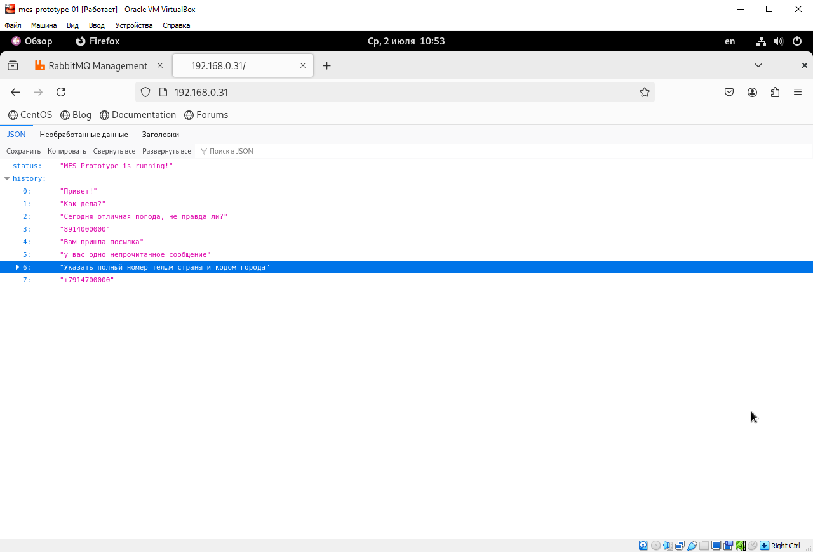
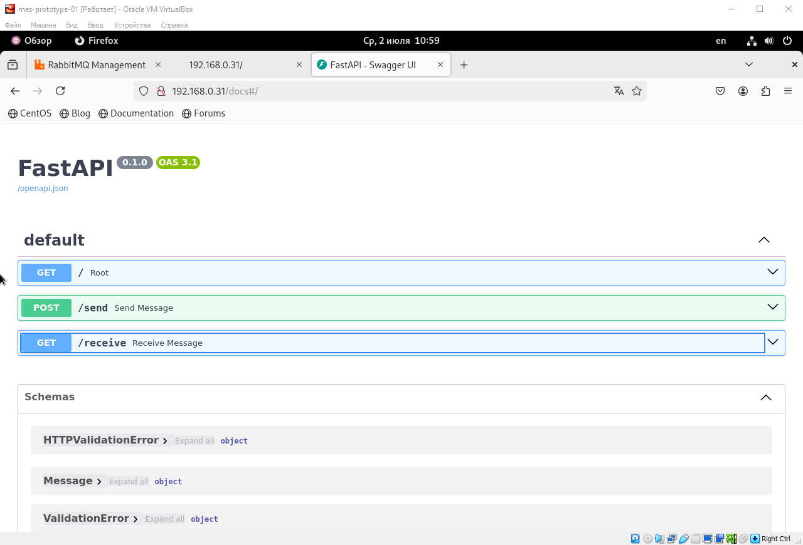
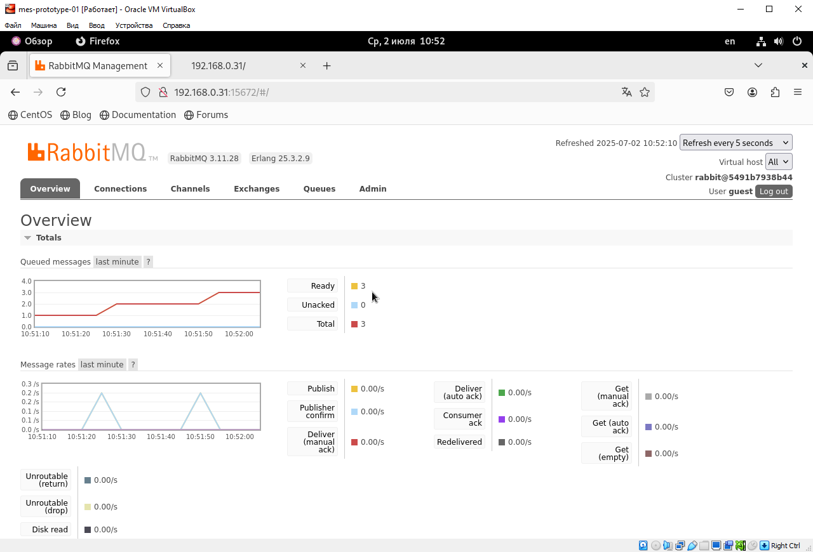

# mes-prototype-01

**ОС:** CentOS Stream 9
**Технологии:** Docker, Nginx, FastAPI, RabbitMQ

## Структура проекта

src/
└── mes-prototype/
    ├── docker-compose.yml
    ├── fastapi/
    │   ├── Dockerfile
    │   ├── requirements.txt
    │   └── app/
    │       └── main.py
    └── nginx/
        └── nginx.conf

## Открытые порты

- **80** — HTTP (Nginx, проксирует запросы к FastAPI)
- **8000** — FastAPI (доступен только внутри Docker-сети)
- **15672** — Web-интерфейс RabbitMQ (RabbitMQ Management UI)
- **5672** — RabbitMQ (для приложений/клиентов)

## Хосты для доступа

- **API и веб-интерфейс:**
  http://localhost/
  http://192.168.0.31/

- **Swagger-документация FastAPI:**
  http://localhost/docs
  http://192.168.0.31/docs

- **RabbitMQ Management UI:**
  http://localhost:15672
  http://192.168.0.31:15672 
  (логин/пароль: guest/guest)

