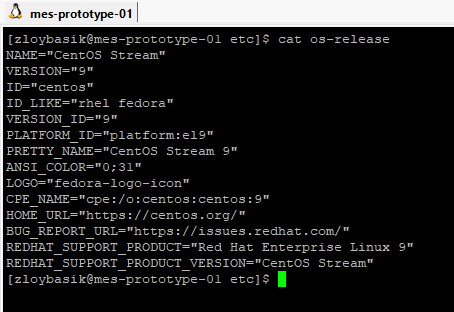

# mes-prototype-01

**ОС:** CentOS Stream 9

**Технологии:** Docker, Nginx, FastAPI, RabbitMQ

## Структура проекта

src/
├── docker-compose.yml
├── fastapi/
│ ├── Dockerfile
│ ├── requirements.txt
│ └── app/
│ ├── main.py
│ ├── test_main.py
│ └── test_rabbitmq_integration.py
└── nginx/
└── nginx.conf

## Открытые порты

- **80** — HTTP (Nginx, проксирует запросы к FastAPI)
- **8000** — FastAPI (только внутри Docker-сети)
- **15672** — Web-интерфейс RabbitMQ
- **5672** — RabbitMQ (для приложений)

## Хосты для доступа

- **API и веб-интерфейс:**
  http://localhost/
  http://192.168.0.31/
  

- **Nginx reverse proxy** 
  (обеспечивает маршрутизацию HTTP-запросов к FastAPI и защищает внутренние сервисы)
  

- **Swagger-документация FastAPI:**
  http://localhost/docs
  http://192.168.0.31/docs
  

- **RabbitMQ Management UI:**
  http://localhost:15672
  http://192.168.0.31:15672
  (логин/пароль: guest/guest)
  

---

## Быстрый запуск

cd src/mes-prototype
docker compose up --build

## Тестирование

cd src/mes-prototype/fastapi
PYTHONPATH=. pytest

## Линтинг

pip install flake8
flake8 app

## CI/CD

- Все тесты и линтер запускаются автоматически в GitHub Actions (`.github/workflows/ci.yml`) при каждом push и pull request.

---
